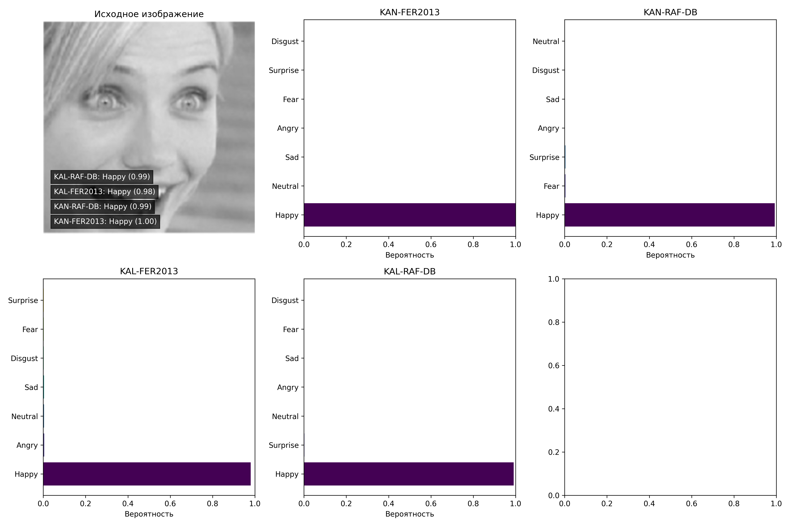

# KAN-FER: Модели распознавания эмоций на основе Kolmogorov-Arnold Networks

Этот проект содержит реализацию моделей для распознавания эмоций на изображениях лиц с использованием архитектур Kolmogorov-Arnold Networks (KAN) и их вариаций.

## Описание

Проект предлагает набор предобученных моделей для распознавания эмоций на основе архитектур KAN и KAL (Kolmogorov-Arnold Legendre Network). Модели обучены на популярных наборах данных эмоций:
- FER2013
- RAF-DB

## Требования

Для работы с этим проектом необходимо установить следующие зависимости:

```bash
pip install torch matplotlib numpy pillow
```

Также необходимо установить библиотеки, реализующие KAN архитектуры:

```bash
# Установка TorchKAN
git clone https://github.com/1ssb/torchkan.git

# Установка Efficient-KAN
git clone https://github.com/Blealtan/efficient-kan.git
```

## Структура проекта

- `src/models/` - содержит реализации моделей KANFER2013, KANRAFDB, KALFER2013, KALRAFDB
- `test.py` - скрипт для тестирования моделей на изображении

## Использование

Проект позволяет распознавать эмоции на изображениях лиц с помощью различных моделей:

```python
from src.models import KANFER2013, KANRAFDB, KALFER2013, KALRAFDB
from PIL import Image

# Загрузка изображения
img = Image.open("путь_к_изображению.jpg")

# Инициализация модели
model = KANFER2013()

# Получение предсказаний
predictions = model.predict(img)
```

### Тестовый скрипт

Файл `test.py` предоставляет функциональность для тестирования всех реализованных моделей на одном изображении:

1. Загружает изображение из файла `test_image.jpg`
2. Запускает предсказание с использованием всех четырех моделей (KAN-FER2013, KAN-RAF-DB, KAL-FER2013, KAL-RAF-DB)
3. Визуализирует результаты в виде гистограмм вероятностей эмоций
4. Отображает исходное изображение с указанием наиболее вероятной эмоции от каждой модели
5. Сохраняет результат в файл `result.png`

Для запуска тестового скрипта:

```bash
python test.py
```

## Особенности моделей

- **KAN-FER2013**: Модель на основе Kolmogorov-Arnold Network, обученная на датасете FER2013
- **KAN-RAF-DB**: Модель на основе Kolmogorov-Arnold Network, обученная на датасете RAF-DB
- **KAL-FER2013**: Модель на основе Kolmogorov-Arnold Legendre Network, обученная на датасете FER2013
- **KAL-RAF-DB**: Модель на основе Kolmogorov-Arnold Legendre Network, обученная на датасете RAF-DB

## Пример результата

При запуске `test.py` создается визуализация, которая показывает:
- Исходное изображение
- Гистограммы вероятностей для всех моделей
- Итоговые предсказания на исходном изображении



## Ссылки на используемые библиотеки

- [TorchKAN](https://github.com/1ssb/torchkan) - Реализация KAN на PyTorch
- [Efficient-KAN](https://github.com/Blealtan/efficient-kan) - Эффективная реализация KAN
